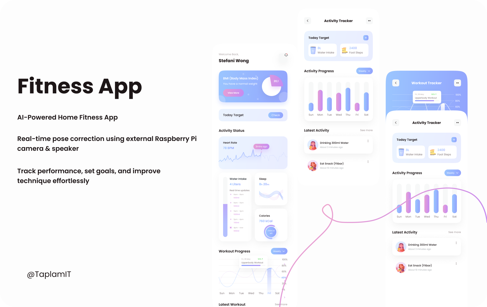

# 📱 GymPoseAI – Mobile App

This is the official **React Native (Expo)** mobile application for **GymPoseAI**, a smart AI-powered workout assistant designed to help users train effectively from home using real-time posture analysis and feedback.



---

## 🚀 Key Features

- 🤖 **Real-time Pose Feedback** using AI (from external camera).
- 📊 **Workout History Tracking**: type, duration, repetitions, and scores.
- 📈 **Progress Visualization** with weekly/monthly/yearly charts.
- 🎯 **Goal Setting & Reminders** for hydration and calories burned.
- 🔔 **Push Notifications** using Firebase Cloud Messaging (FCM).
- 🔐 **Secure Login** via OAuth 2.0 (Facebook supported).

---

## ⚙️ Tech Stack

| Feature           | Technology                  |
| ----------------- | --------------------------- |
| Language          | TypeScript / JavaScript     |
| Framework         | React Native + Expo SDK     |
| State Management  | React Context + React Query |
| Local Storage     | AsyncStorage                |
| API Communication | Axios + WebSocket           |
| Video Streaming   | WebRTC                      |
| Notifications     | Firebase Cloud Messaging    |

---

## 📲 Getting Started

### 1. Clone the Repository

```bash
git clone https://github.com/Dangtruong-DUT/GymPoseAI-
cd gymposeAI/mobile
```

### 2. Install Dependencies

```bash
npm install
```

### 3. Run the App (Expo)

```bash
npm run dev --clear
```

### 4. build with Expo eas

```bash
eas build --profile development --platform android
```

## ⚠️ Platform Limitation & Setup Notes

⚠️ Currently, this mobile application is only supported on Android.

Due to technical constraints with camera permissions, Facebook SDK integration, and WebRTC support, iOS is temporarily unsupported. We are actively working on multi-platform support in future releases.

## 🔐 Facebook OAuth Setup

This app uses `react-native-fbsdk-next` for Facebook login. You need to:

- Configure your Facebook App in Facebook Developer Console.
- Set up your `android/app/src/main/AndroidManifest.xml` and `strings.xml` with proper Facebook App ID and Client Token.
- Follow the [fbsdk-next Android setup guide](https://github.com/thebergamo/react-native-fbsdk-next)

## 🔔 FCM Push Notification Setup

Push notifications use Expo Push Tokens and Firebase Cloud Messaging:

- Make sure your Firebase project is properly set up and linked with Expo.
- Add your FCM server key to Expo Push Notification settings.
- The app automatically fetches the Expo Push Token, but you'll need to allow notification permissions on first launch.
- For advanced configuration, refer to [Expo Notifications Docs](https://docs.expo.dev/versions/latest/sdk/notifications/)
